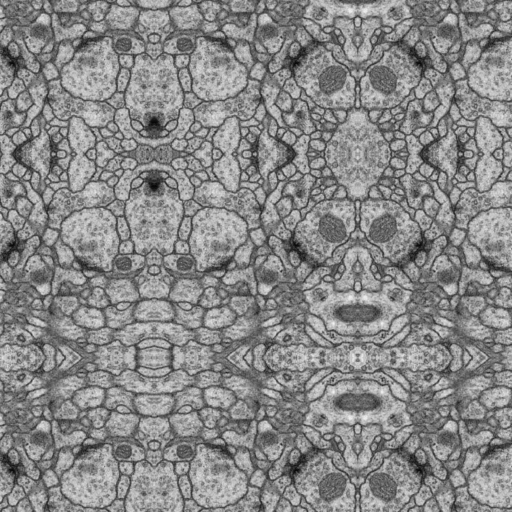
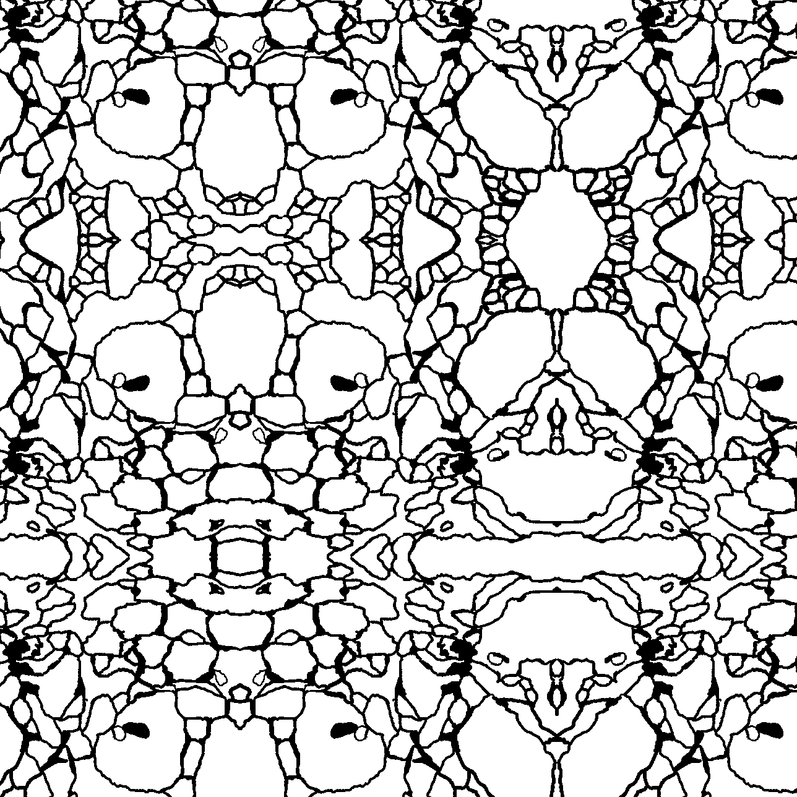
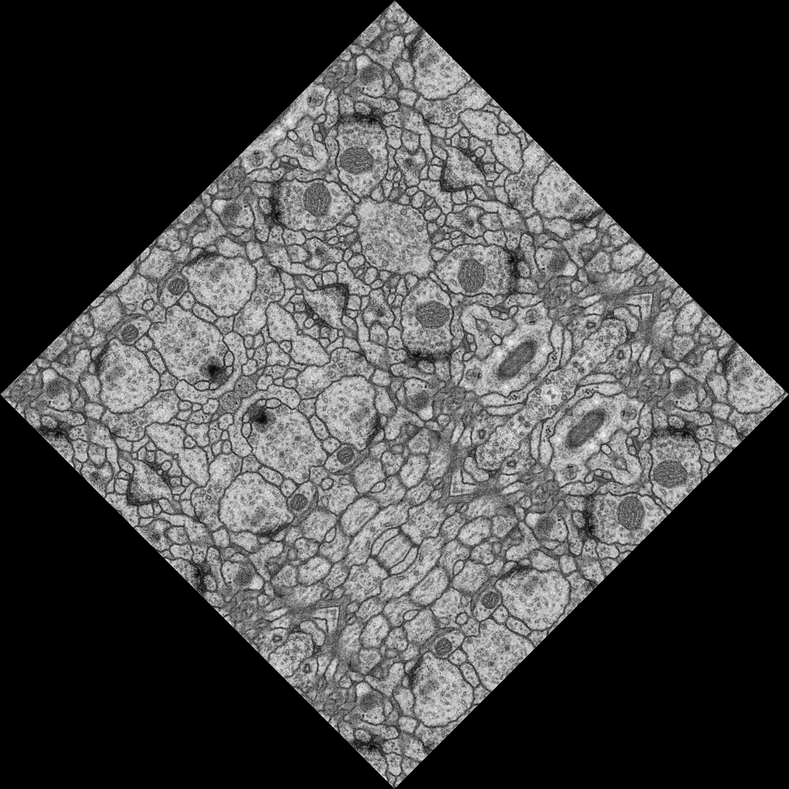
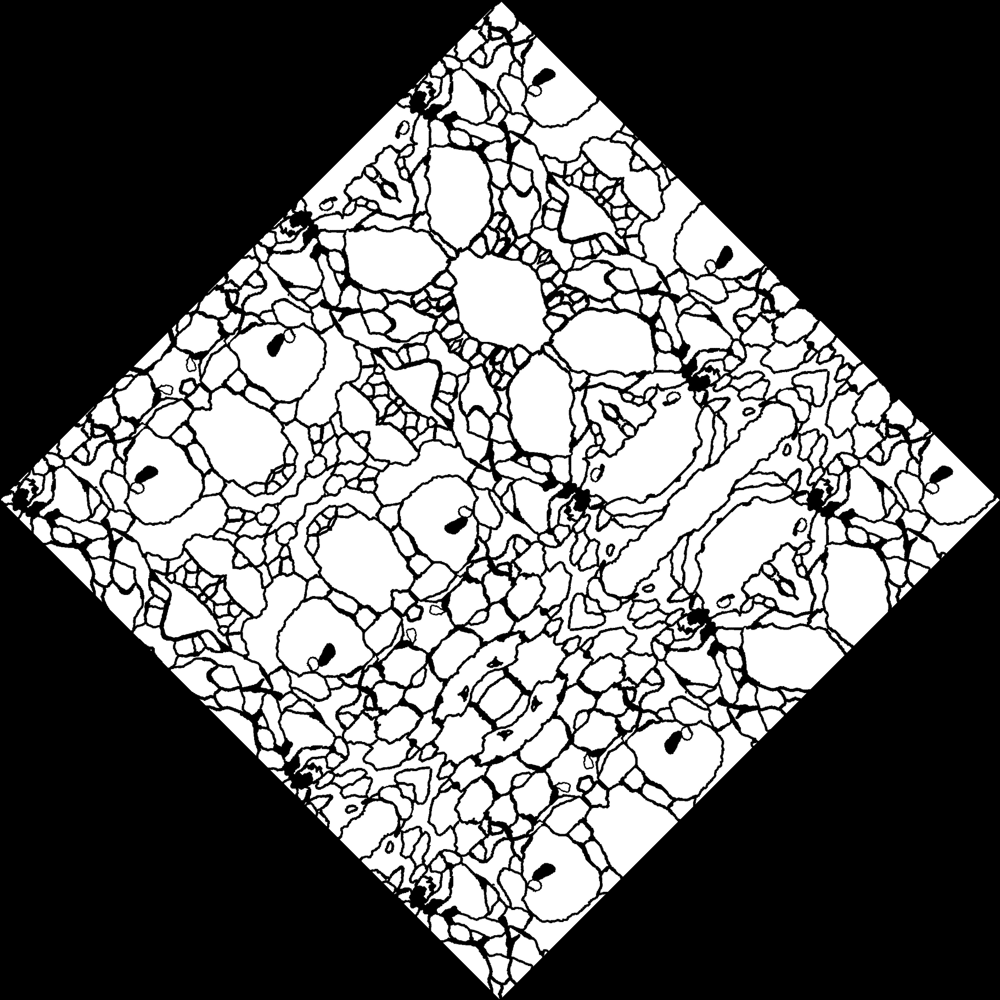
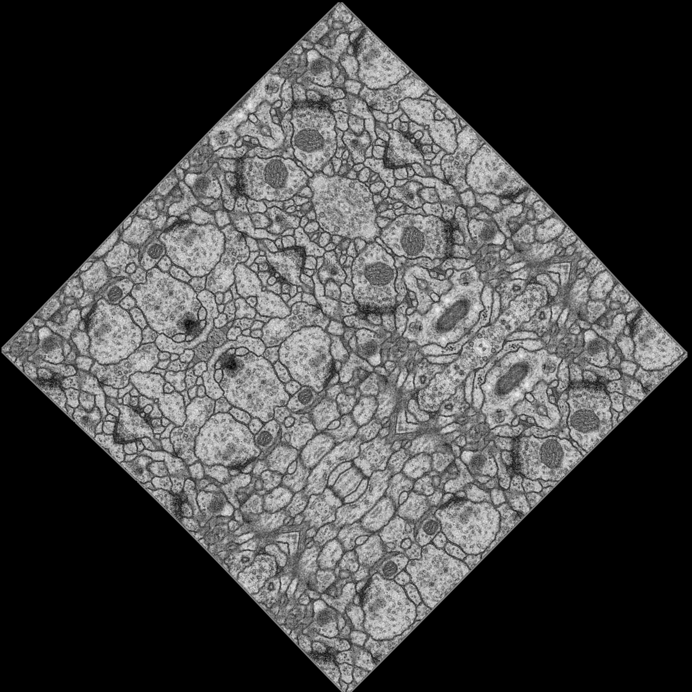
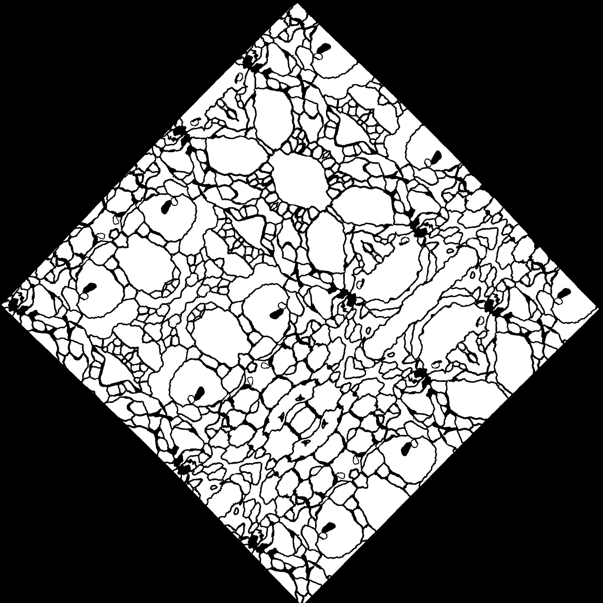
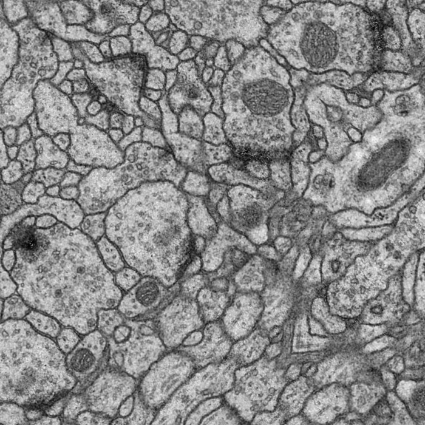
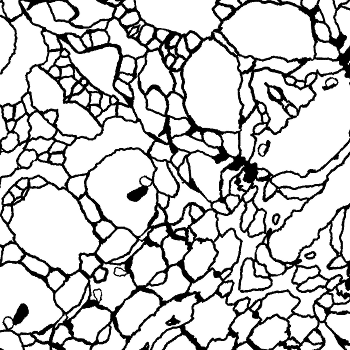

# U-net paper Reproduction Report

by:
* Vera Hoveling, V.T.Hoveling@student.tudelft.nl, 4591941
* Sayra Ranjha S.S.Ranjha@student.tudelft.nl, 4555449
* Maaike Visser, M.E.B.P.Visser@student.tudelft.nl, 4597265

## Introduction
This document details our reproduction of the now seminal paper "U-net: Convolutional Networks for Biomedical Image Segmentation", by Ronneberger et al (https://arxiv.org/abs/1505.04597). This project was undertaken as part of the Deep Learning course (CS4240) at the Delft University of Technology.
*U-Net architecture*

In this document we briefly explain the U-Net architecture, as well as the steps we took to reproduce the "Pixel Error" the result from Table 1. We also include a quality measure not present in the original paper for the specific data set we used, namely the Intersection over Union.

Pre-trained models are also available for evaluation purposes.

## U-Net
[small explanation of U-Net]

# Implementation
We have implemented the network both with Pytorch and Keras. The same hyperparameter settings were used for both implementations, showing not only that it is possible to reproduce the work but also inspect differences one might encounter when using another framework. In this section we will detail both implementations, as well as the implementation of the data augmentation.
## Data augmentation
## Keras Implementation
The keras implementation kan be found in the Google Colab that accompanies this report, [click here](https://colab.research.google.com/drive/1iR5q2TLUXjYJtPW1v-eShGFQcmKILR7r) The implementation
# Training
##Training with Keras

## Training with Pytorch

# Results

| framework | intersection over union | pixel error         |   |   |
|-----------|-------------------------|---------------------|---|---|
| keras     | 0.880027184589537       | 0.09784660339355469 |   |   |
| pytorch   |                         |                     |   |   |

## Motivation of choices / Discussion

## Data augmentation
Since the available datasets were very small (in the order of 30 images), we had to augment the datasets in order to ensure that there was enough train and test data available.

In the paper by Ronneberger et al.[^unet], the data augmentation consisted of padding the image by mirroring the borders and performing an elastic deformation on the resulting image. There was also mention of some rotations being performed on the images.

We implemented the data augmentation using the following steps for each image and its label in the dataset:

### Step 1: Padding
The image is padded by mirroring it along its borders. This is to ensure that the pixels in the border region of the image will have enough context during convolution. Mirroring is used in contrast to just performing zero-padding, as zero-padding does not provide any valid and useful information. The padding is larger than is required for the final output size, since the next steps will introduce artifacts at the borders that need to be removed later.

### Step 2: Rotation
The padded image is rotated by a specified angle. This step is not always performed, since we also wanted to produce datasets without rotation.

### Step 3: Elastic deformation
Elastic deformations are performed on the image to simulate natural deformations.

The image below by Falk et al. [^deform] illustrates how elastic deformation works. A coarse grid (b) is placed over the image and for each cell a random displacement vector is generated, denoted by the blue arrows. These displacement vectors can be sampled from a Gaussian distribution for example. Then, the displacements for each pixel, indicated by the black arrows, are computed using bicubic interpolation. The per-pixel displacements define how the image is deformed. The resulting deformation is best illustrated by the grid in the bottom left of (c), which is the deformed version of the grid in (a).

![An example of elastic deformation by Falk et al. [^deform]](figs/elastic-deform.png)

Ronneberger et al.[^unet] use a 3x3 grid, and sample the displacement vectors from a Gaussian distribution with a standard deviation of 10 pixels. We used the [elasticdeform](https://github.com/gvtulder/elasticdeform) library to perform the elastic deformations using the aforementioned parameters.

### Step 4: Cropping
Finally, the images are cropped to their final size. The cropping removes the border artifacts caused by the elastic deformations and rotations, and ensures that the final image has the size that is required for the network input.

The input images of the network should have a size such that all max-pooling operations are performed on layers with even dimensions. We also decided that the network should output a label for the entire original image, in order to lose no information at the border. This is in contrast to the original paper, where the output is a cropped version of the input image. For the ISBI segmentation challenge dataset, this means that the 512x512 images are padded to have a final size of 700x700, which ensures a valid max-pooling in all layers and a network output of 514x514, which is then further cropped to 512x512.

## Confusion stuff on upsampling/transposed convolution/upconvolution
## All other questions for authors

# Future work

# References
[^deform]: Falk et al. (2019). U-Net: deep learning for cell counting, detection, and morphometry. Nature Methods. 16. 10.1038/s41592-018-0261-2

[^unet]: Ronneberger et al. (2015) U-net: convolutional networks for biomedical image segmentation. In: International conference on medical image computing and computer-assisted intervention. Springer, pp 234–241
