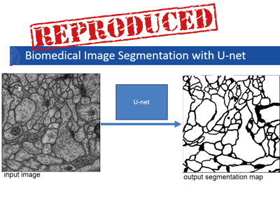
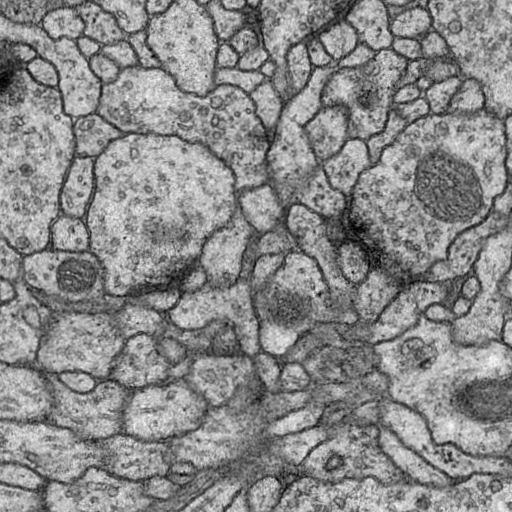
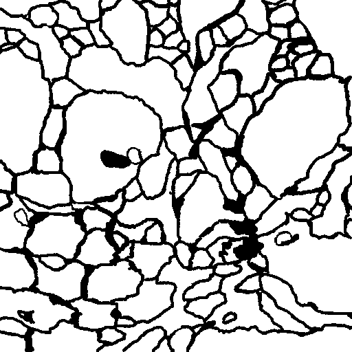
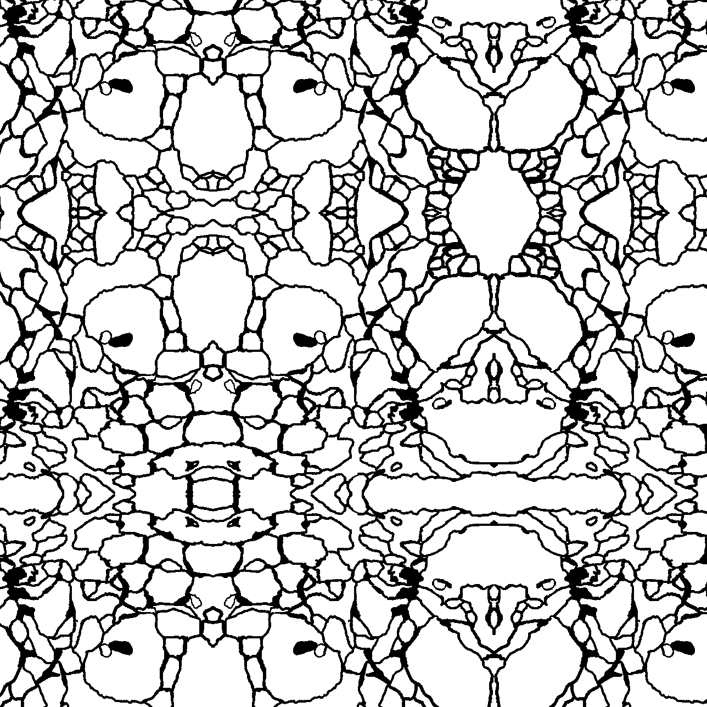
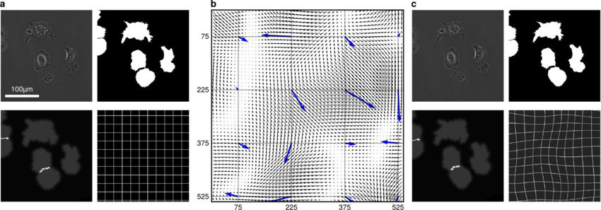
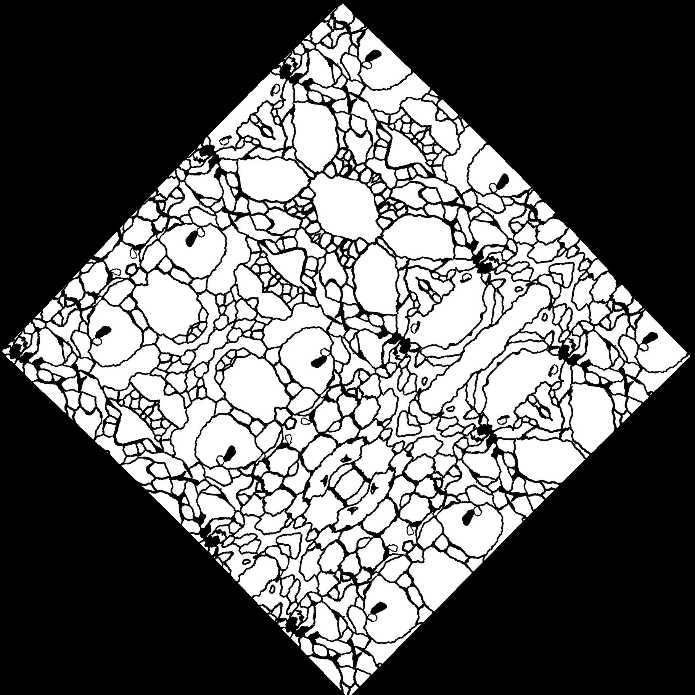
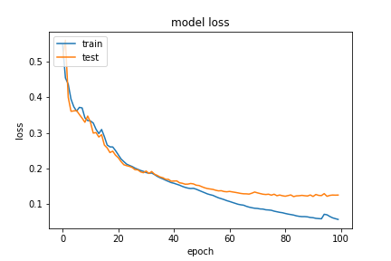
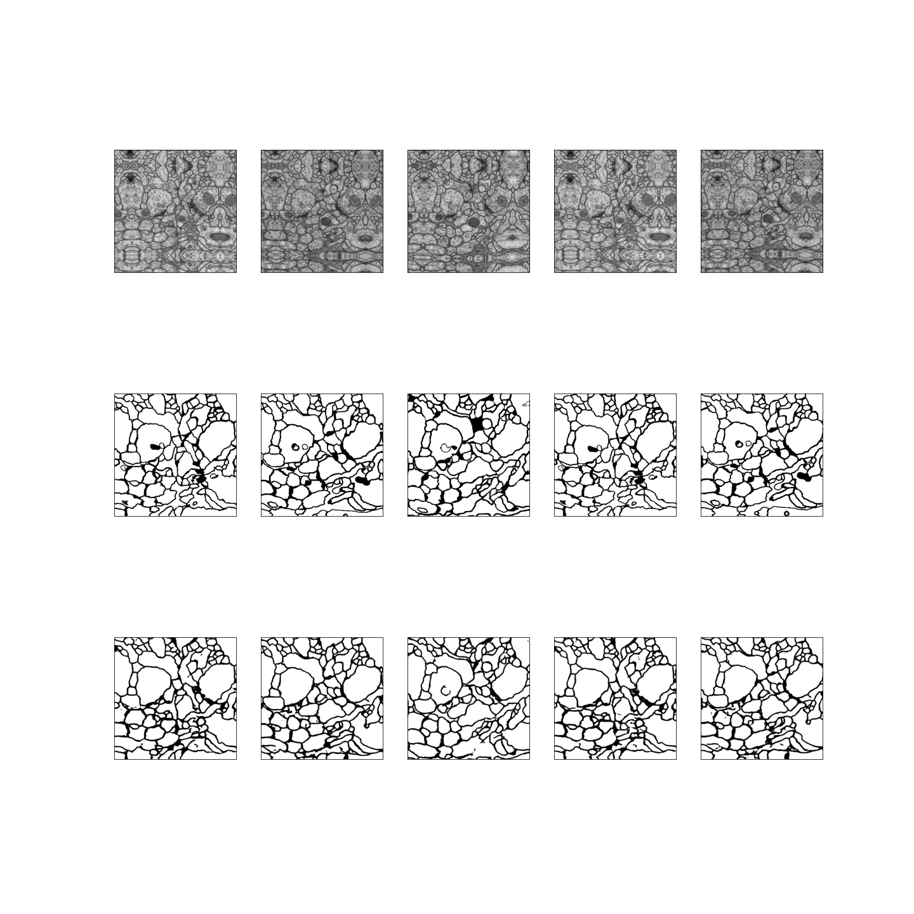

<!-- rmarkdown v1 -->
## U-net paper Reproduction Report

by:

* Vera Hoveling, V.T.Hoveling@student.tudelft.nl

* Sayra Ranjha S.S.Ranjha@student.tudelft.nl

* Maaike Visser, M.E.B.P.Visser@student.tudelft.nl

## Introduction

This document details our reproduction of the now seminal paper "U-net: Convolutional Networks for Biomedical Image Segmentation", by Ronneberger et al[^1]. This project was undertaken as part of the Deep Learning course (CS4240) at the Delft University of Technology. Note that multiple reproductions of this paper have been attempted for this course and that some of these reproductions can be found on [https://reproducedpapers.org/](https://reproducedpapers.org/).

In this report, we briefly explain the U-Net architecture, as well as the steps we took to reproduce the results of the original paper. To do so, we implemented the network both with Pytorch and Keras. The same hyperparameter settings were used for both implementations, showing not only that it is possible to reproduce the work but also inspect differences one might encounter when using another framework. Below we will detail both implementations.

We conclude with a quantitative analysis of our results and concluded that the paper was successfully reproduced. Code and pre-trained models are available for evaluation purposes.

## U-Net

U-Net is a convolutional neural network that was developed specifically for the classification of images in biomedical tasks. Two elements set these tasks apart from “regular” image classification by CNNs: the need for localization (i.e. a label should be assigned to each pixel, not just to the entire image[^2]), and the small number of available training images.

The U-Net architecture is an extension of the so-called “fully convolutional network” (FCN)[^3]. In these networks, every layer is a convolutional layer. First, convolutions are applied that decrease the resolution of the image and increase the number of channels (contracting path). Then, transposed convolutions are used to reduce the number of channels and increase the resolution (expanding path). Instead of fully connected layers at the end of the network, the last layer of the FCN maps to an image with the same size as the input image, but with the number of channels equal to the desired number of labels. A softmax function is then used to determine which label is the most likely. To improve accuracy at the last transposed convolution, feature maps resulting from earlier pooling operations are used in later convolutions, retaining more information about the original image. This is what is known as a skip-connection.[^4]

It should be noted that in the original paper, the expanding path is described as, among other things, consisting of “an upsampling of the feature map followed by a 2x2 convolution (“up-convolution”) that halves the number of feature channels, [...]”[^1]. This turned out to be a source of some confusion, as is described in more detail later.

U-Net extends the FCN by using more skip connections as well as using a larger number of feature channels in the expanding path of the network (see Figure 2). Each layer in the contracting path of the U-shaped network consists of two 3x3 convolutions, followed by ReLUs. The feature map resulting from the last of these ReLUs is saved for re-use in the expanding path. [^1]

Figure 2: “U-net architecture (example for 32x32 pixels in the lowest resolution). Each blue box corresponds to a multi-channel feature map. The number of channels is denoted on top of the box. The x-y-size is provided at the lower left edge of the box. White boxes represent copied feature maps. The arrows denote the different operations.”[^1]

## Experiments

The authors of the original paper conduct three experiments on different datasets from both the “Segmentation of neuronal structures in EM stacks” ISBI challenge (segmentation challenge)[^8] and the ISBI cell tracking challenge of 2015[^9]. The results of these experiments are summarized in Tables 1 and 2 of the original paper.

For our reproduction we decided to focus on the segmentation challenge because of its simpler data set. The dataset for the segmentation challenge consists of 32 images and corresponding ground-truth labels. The reason we consider this dataset to be easier is because there are only two output channels.

## Data Augmentation {#sec-augmentation}

As mentioned by Ronneberger et al[^1], a common issue with image segmentation tasks in the biomedical domain is that very little training data is available. Indeed, the available datasets contained only around 30 images. Therefore, we had to augment the datasets to ensure that there was enough train and test data available.

In the paper by Ronneberger et al.[^1], the data augmentation consisted of padding the image by mirroring the borders and performing an elastic deformation on the resulting image. There was also mention of some rotations being performed on the images.

We implemented the data augmentation using the following steps for each image and its label in the dataset:

{ width=200px }
{ width=200px }

### Step 1: Padding

The image is padded by mirroring it along its borders. This is to ensure that the pixels in the border region of the image will have enough context during convolution. Mirroring is used in contrast to just performing zero-padding, as zero-padding does not provide any valid and useful information. The padding is larger than is required for the final output size, since the next steps will introduce artifacts at the borders that need to be removed later.

{ width=200px }
{ width=200px }

### Step 2: Rotation

The padded image is rotated by a specified angle. This step is not always performed, since we also wanted to produce datasets without rotation.

{ width=200px }
{ width=200px }

### Step 3: Elastic deformation

Elastic deformations are performed on the image to simulate natural deformations.

The image below by Falk et al.[^12] illustrates how elastic deformation works. A coarse grid (b) is placed over the image and for each cell a random displacement vector is generated, denoted by the blue arrows. These displacement vectors can be sampled from a Gaussian distribution for example. Then, the displacements for each pixel, indicated by the black arrows, are computed using bicubic interpolation. The per-pixel displacements define how the image is deformed. The resulting deformation is best illustrated by the grid in the bottom left of (c), which is the deformed version of the grid in (a).

{ width=400px }

Ronneberger et al. use a 3x3 grid and sample the displacement vectors from a Gaussian distribution with a standard deviation of 10 pixels. We used the [elasticdeform](https://github.com/gvtulder/elasticdeform) library to perform the elastic deformations using the aforementioned parameters.

### Step 4: Cropping

Finally, the images are cropped to their final size. The cropping removes the border artifacts caused by the elastic deformations and rotations, and ensures that the final image has the size that is required for the network input.

The input images of the network should have a size such that all max-pooling operations are performed on layers with even dimensions. We also decided that the network should output a label for the entire original image, to lose no information at the border. This is in contrast to the original paper, where the output is a cropped version of the input image. For the ISBI segmentation challenge dataset, this means that the 512x512 images are padded to have a final size of 700x700, which ensures a valid max-pooling in all layers and a network output of 514x514, which is then further cropped to 512x512.

{ width=200px }
{ width=200px }

## Network Architecture Implementation

U-Net was originally implemented in the Caffe framework[^1][^14]. However, the framework was last updated 2 years ago[^15]. Since then, new frameworks have been developed. We thought it would be interesting to compare the difference in performance between implementations in two of these frameworks: Keras[^16] and PyTorch[^17]. We will detail both implementations here. Code can be found on [github]([https://github.com/asylunatic/unet](https://github.com/asylunatic/unet).

### Keras Implementation

The Keras implementation can be found in the [github repository](https://github.com/asylunatic/unet) that accompanies this report. We will briefly go over the implementation here for completeness.

The implementation loads the augmented dataset from Kaggle (one can choose how large the training set should be). The dataset is then loaded into memory as a training set and a test set. Note that the training set and test set are already separated in the Kaggle repository and that the images in the test set do not contain augmented versions of images used for the training set and vice versa.

Next, we define and compile the network architecture, sticking to the exact dimensions as detailed in the paper. For the architecture we used the Keras Sequential model. The Sequential model is a linear stack of layers, which enabled us to specify each layer of the network sequentially. This made the network rather straightforward to write and to debug. We did not write custom layers for the models but took advantage of Keras’ build in [Conv2D](https://keras.io/layers/convolutional/), [MaxPooling2D](https://keras.io/layers/pooling/), [UpSampling2D](https://keras.io/layers/convolutional/) and [Cropping2D](https://keras.io/layers/convolutional/) layers as well as the [concatenate function](https://keras.io/layers/merge/). We used Keras’ standard weight initialization for all layers, which is Xavier uniform[^18].

### Pytorch Implementation

One of the advantages of PyTorch is that it allows splitting up and combining different layers in modules. As such, we could group together the different kinds of components (e.g. downconvolutions and relus, upsampling/transpose convolutions and relus) and easily change their parameters.

It was unclear to us whether the authors intended the expanding path to consist of a series of transpose convolutions, or upsamplings followed by normal convolutions. Because of its flexibility, we were able to test both implementations in PyTorch.

In the end, much like with the Keras implementation, we used combinations of PyTorch’s built-in convolutional layers to reconstruct the U-Net architecture. The weights of each convolutional layer were initialized either with Xavier normal or Kaiming normal[^19] distributions.

## Training

The code can be found on [github](https://github.com/asylunatic/unet). To train the models yourself, we highly recommend loading the notebooks into Google Colab, which is what we did as well.

To train our models, we used a dataset of 300 images, augmented as described in the section on [Data Augmentation](#sec-augmentation). The dataset was randomly split into a training set with 240 images (80%) and a validation set with 60 images (20%).

### Training with Keras

We partitioned the dataset as described above. The validation set was used to monitor training progress and to schedule the learning rate. For the optimizer we used SGD with a high momentum (0.99 as provided by the paper) and a learning rate of 0.01 (more empirically determined). Furthermore we implemented a learning rate scheduler based on the validation loss, with a factor of 0.1, patience of 10 and a minimum learning rate of 0.00001.

Training in the Keras implementation seemed rather volatile and we found that there was a tendency to find local minima for completely black images and then to stay stuck there. We tried several remedies such as varying the size of the training set and more modern optimizers like Adadelta, which were not available at the time of the publishing of the paper, but to no avail. However, we were able to do some more stable training after introducing a batch size of larger than one. The batch size of one was specified in the paper, but was mainly determined due to memory constraint at the time.

Below we show the training curve of the final model that we obtained, using the learning rate scheduler and a batch size of five for about 100 epochs. Note that the model seems to slightly overfit at the end but as the results on the validation set did not yet worsen, we deemed this an acceptable result.

### Training with PyTorch

We partitioned the dataset as described above. Then, we trained with SGD (momentum 0.99), a learning rate of 0.01, and learning rate scheduling with a patience of 10 and a minimum learning rate of 0.00001. Additionally, we implemented an early-stopping scheme with a patience of 5 and a minimum improvement of 0.001 to prevent overfitting.

Training in PyTorch was uneventful and straightforward. The only time we ran into problems was when we tried to use Kaiming initialization in combination with upsampling. Somehow, the interaction between the initialization method and the type of layers caused weights to shoot up to infinity almost instantly.

Below we show the learning curves we obtained, using upsampling and Xavier normal initialization, transpose convolution and Xavier normal, and transpose convolution and Kaiming normal initialization respectively.

## Results

### Evaluation Methods

For quantitative evaluation, we used the "pixel error" metric also used by the ISBI cell segmentation challenge[^20]. A FIJI plugin for calculating this error is available[^21], but to more easily evaluate our results we wrote our own python implementation (included in the notebooks). The pixel error is calculated as 1 minus the maximum F1 score[^22].

We also include a quality measure not present in the original paper for the specific data set we used, namely the Intersection over Union (IOU). Ronneberger et al did apply IOU to the dataset from the cell tracking challenge. The IOU is calculated by first thresholding the predicted labels at 0.5, e.g., every value above 0.5 becomes a 1, every value below becomes a 0. Then, the intersection and union of the predicted label and the true label are found, and finally the intersection divided by union is calculated.

### Results

+------------------------------------------+----------------------------+----------------+
| Framework                                | Intersection over union    | Pixel error    |
+==========================================+============================+================+
| Caffe (original implementation)          | \-                         | 0.0611         |
|                                          |                            |                |
+------------------------------------------+----------------------------+----------------+
|                                          |                            |                |
+------------------------------------------+----------------------------+----------------+
| Keras - upsampling, xavier               | 0.880                      | 0.0978         |
| normal initialization                    |                            |                |
+------------------------------------------+----------------------------+----------------+
|                                          |                            |                |
+------------------------------------------+----------------------------+----------------+
| Pytorch - upsampling, xavier             | 0.838                      | 0.0885         |
| xavier normal initialization             |                            |                |
+------------------------------------------+----------------------------+----------------+
|                                          |                            |                |
+------------------------------------------+----------------------------+----------------+
| Pytorch - transpose convolution,         | 0.842                      | 0.0867         |
| xavier normal initialization             |                            |                |
+------------------------------------------+----------------------------+----------------+
|                                          |                            |                |
+------------------------------------------+----------------------------+----------------+
| Pytorch - transpose convolution,         | 0.846                      | 0.0836         |
| kaiming normal initialization            |                            |                |
+------------------------------------------+----------------------------+----------------+

Table 1: The pixel error and IOU of different models on the augmented segmentation challenge dataset.

For a more qualitative inspection, we also provide a plot with some of the results of the Keras model: \

In this plot one can see the input image, the target labels and the output of the network for a couple of test samples in rows 1, 2 and 3 respectively.

## Discussion

### Discussion of results

We did not obtain a pixel error as low as reported in the paper. However, both implementations obtained results that we deem satisfying and a visual inspection of the results confirm that.

Upon a first glance, the results look very convincing. If anything, some are so good that we had to double-check that indeed no test images could have been augmented variations of training data (they were not!). Taking a closer look, one can see that the results indeed are not perfect. For example in the plot above, we see that ‘in-cell’-details are often ignored by the network.

### Unclarities from the paper

#### Unanswered author questions

The paper very clearly explains how the network is constructed, with clear illustrations. This enabled us to reconstruct the overall architecture with relative ease. However, the paper did leave some remaining unclarities. To gain a clear understanding, we formulated the following questions to the authors:

1. What was the exact procedure that was used for the data augmentation? Did you use other augmentation than the elastic deform? How did you apply them and what were their parameters?
2. What was the final size of the augmented training set and ratio of each augmentation in the training set?
3. What are the network hyper-parameters (optimizer, learning rate etc) that you used in training?

Unfortunately, we did not receive an answer to our repeated attempts to contact the authors. The questions remain unanswered.

#### Ambiguous definition of upconvolution

The paper that U-Net was based on explicitly states the use of transposed convolution[^23], as do the authors in the video presentation of their work[^1]. However, in the paper itself, the authors write: “_Every step in the expansive path consists of an upsampling of the feature map followed by a 2x2 convolution (“up-convolution”) that halves the number of feature channels._” We initially interpreted this as a redefinition of the term “up-convolution”, instead of meaning transpose convolution. As we attempted to limit our exposure to outside sources, it took us a while to figure out that this different interpretation existed. In the end we decided to try out both upsampling and transpose convolution.

The ambiguity surrounding up-convolution is also the reason that the weight initialization is different in the Keras and Pytorch implementations, which are both different from the original paper. The original paper prescribes that the initial weights should be drawn “from a Gaussian distribution with a standard deviation of √2/N, where N denotes the number of incoming nodes of one neuron”[^1]. However, when we implemented this method of initialization, we were still under the impression that the expanding path consisted of upsamplings followed by convolutions instead of transpose convolutions. The author’s method of initialization seemed to cause the same problem as Kaiming initialization, namely weights shooting up to infinity quickly. It was only in the last weeks that we changed the implementation to also allow transpose convolutions, so in the interest of time we decided to stick with a built-in initialization method.

## Future Work

### Other datasets

Our reproduction focused on the ISBI Challenge segmentation dataset. However, the U-net paper targeted not one, but three datasets: it was also trained for the ISBI cell tracking challenge (on the “PhC-U373” and  “DIC-HeLa” datasets). These datasets have different numbers of targeted classes so they require subtle changes to the network. A logical next step to investigate would thus be to adapt the network and train on those datasets.

### Weight map

The authors mention a weight map that they introduced to give some pixels more importance in the training. However, the exact way in which to compute the weight map and the fact that we achieved decent results without it made us decide to give it low priority. However, it may very well be the case that adding the weight maps will further improve results. Thus, this would be a suitable direction for future work.

### Dropout layers

The authors mention almost in an offhand manner that “Drop-out layers at the end of the contracting path perform further implicit data augmentation.”[^1] However, no further details on e.g. number of layers or hyper parameters were provided. It would be interesting to see how adding different numbers of dropout layers would further influence the performance.

<!-- Footnotes themselves at the bottom. -->
<!-- ## Notes -->

[^1]:
     (2015, 18 May). U-Net: Convolutional Networks for Biomedical Image .... Retrieved April 20, 2020, from [https://arxiv.org/abs/1505.04597](https://arxiv.org/abs/1505.04597)

[^2]:
     (2019, May 22). A Gentle Introduction to Object Recognition With Deep Learning. Retrieved April 20, 2020, from [https://machinelearningmastery.com/object-recognition-with-deep-learning/](https://machinelearningmastery.com/object-recognition-with-deep-learning/)

[^3]:
     (2014, November 14). Fully Convolutional Networks for Semantic Segmentation. Retrieved April 20, 2020, from [https://arxiv.org/abs/1411.4038](https://arxiv.org/abs/1411.4038)

[^4]:
     (n.d.). Literature Review: Fully Convolutional Networks - Self-Driving .... Retrieved April 20, 2020, from [https://medium.com/self-driving-cars/literature-review-fully-convolutional-networks-d0a11fe0a7aa](https://medium.com/self-driving-cars/literature-review-fully-convolutional-networks-d0a11fe0a7aa)

[^8]:
     (n.d.). ISBI Challenge: Segmentation of neuronal structures in ... - MIT. Retrieved April 20, 2020, from [http://brainiac2.mit.edu/isbi_challenge/home](http://brainiac2.mit.edu/isbi_challenge/home)

[^9]:
     (n.d.). Cell Tracking Challenge. Retrieved April 20, 2020, from [http://celltrackingchallenge.net/](http://celltrackingchallenge.net/)

[^12]:
     Falk et al. (2019). U-Net: deep learning for cell counting, detection, and morphometry. Nature Methods. 16. 10.1038/s41592-018-0261-2 Retrieved April 17, 2020, from [https://experiments.springernature.com/articles/10.1038/s41592-018-0261-2](https://experiments.springernature.com/articles/10.1038/s41592-018-0261-2)

[^14]:
     (2014, June 20). Caffe: Convolutional Architecture for Fast Feature Embedding. Retrieved April 20, 2020, from [https://arxiv.org/abs/1408.5093](https://arxiv.org/abs/1408.5093)

[^15]:
     (n.d.). BVLC/caffe - GitHub. Retrieved April 20, 2020, from [https://github.com/BVLC/caffe](https://github.com/BVLC/caffe)

[^16]:
     (n.d.). Home - Keras Documentation. Retrieved April 20, 2020, from [http://keras.io/](http://keras.io/)

[^17]:
     (n.d.). PyTorch. Retrieved April 20, 2020, from [https://pytorch.org/](https://pytorch.org/)

[^18]:
     (n.d.). Initializers - Keras Documentation. Retrieved April 20, 2020, from [http://keras.io/initializers/](http://keras.io/initializers/)

[^19]:
     (n.d.). torch.nn.init — PyTorch master documentation. Retrieved April 20, 2020, from [https://pytorch.org/docs/stable/nn.init.html](https://pytorch.org/docs/stable/nn.init.html)

[^20]:
     (2015, October 8). Segmentation of neuronal structures in EM stacks challenge .... Retrieved April 20, 2020, from [https://imagej.net/Segmentation_of_neuronal_structures_in_EM_stacks_challenge_-_ISBI_2012](https://imagej.net/Segmentation_of_neuronal_structures_in_EM_stacks_challenge_-_ISBI_2012)

[^21]:
     (2015, September 22). Segmentation evaluation metrics - Script - ImageJ. Retrieved April 20, 2020, from [https://imagej.net/Segmentation_evaluation_metrics_-_Script](https://imagej.net/Segmentation_evaluation_metrics_-_Script)

[^22]:
     (n.d.). F1 score - Wikipedia. Retrieved April 20, 2020, from [https://en.wikipedia.org/wiki/F1_score](https://en.wikipedia.org/wiki/F1_score)

[^23]:
     (n.d.). Fully convolutional networks for semantic segmentation - IEEE .... Retrieved April 20, 2020, from [https://ieeexplore.ieee.org/document/7298965](https://ieeexplore.ieee.org/document/7298965)
